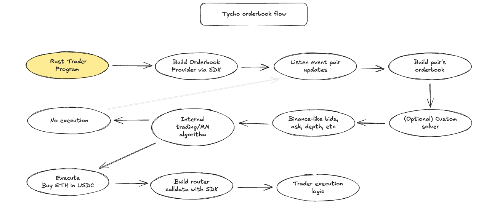

# Introduction

The tycho-orderbook crate transpose onchain liquidity into a familiar orderbook format.

## Why 

In DeFi, liquidity is typically provided by AMMs, which use continuous formulas to distribute liquidity, unlike orderbooks that aggregate discrete limit orders. Despite their differences, both approaches ultimately produce strictly increasing supply curves.

The key insight is that if on-chain liquidity can be seen as a strictly increasing supply curve, it’s possible to replicate that curve with a series of limit orders.

By running numerous simulations, one can derive the incremental supply—essentially, the price levels at which liquidity is available—and then reconstruct an equivalent orderbook.

Since no single liquidity pool fully represents all on-chain liquidity, a router can be used to gather the best price at any depth across various pools, ultimately building an aggregate on-chain liquidity book.

This reconstructed DeFi Orderbook allows traders to:
- Visualize the shape of on-chain liquidity.
- Make informed trade decisions based on precise price levels.
- Query the expected price for a given trade size or the available depth at a specific price.

Tycho can simulate trades across any liquidity pool in microseconds, updating only the parts of the orderbook corresponding to pools that changed in the latest block.

Moreover, it converts any market order on this synthetic orderbook into on-chain call data, enabling execution directly on the blockchain.

An important caveat is that gas costs can cause the supply curve to deviate slightly from being strictly increasing. Unlike traditional orderbooks where costs scale proportionally.

Gas fees introduce discrete jumps—especially noticeable at very small trade amounts or when new liquidity pools (or ticks) are added.

Initially, these costs can worsen the price before improving it as the trade size increases, adding a layer of complexity to the simulated orderbook.

There are many reasons for building such a tool:

1. Bring more traders on-chain: In the familiar format of an orderbook, on-chain liquidity will be easier to read and execute over for a wider set of traders. This can bring new traders, e.g. those with existing strategies for orderbook markets, to use on-chain liquidity.

2. Strengthen on-chain liquidity: Making on-chain liquidity more accessible can increase on-chain volumes, and consequently revenues, and incentivise deeper on-chain liquidity, and the resulting deeper books further incentivises more on-chain trading through better prices.

3. Aggregate liquidity: Another high barrier for traders to trade efficiently against on-chain liquidity is to use the liquidity fragmented over different pools and protocols. A unified orderbook also abstracts the different protocols and pools – and presents them in a unified form.

4. Save time: Unless you have a specifically optimised setup – its hard to do all the simulations required for running sophisticated trading strategies (e.g. determining the supply for 1000 different tokens at 10 different trading volumes). A unified orderbook includes pre-simulated trade amounts that traders can use directly, or as a starting point for "final mile" simulations.

## How 

Under the hood, tycho-orderbook uses [Tycho](https://docs.propellerheads.xyz/tycho).

Tycho-orderbook works as follows:
1. Open a stream on Tycho
2. Receive notification of state update
3. Calculate the orderbook for a specific pair with all relevant liquidity pools
   1. With a default solver, quote different trades (e.g. 1 ETH, 10 ETH, 100 ETH, then, 2K USDC, 20K USDC, 200K USDC)
   2. Take into account gas costs
   3. Produce the onchain price for a given swap
4. Aggregate the output in bids|asks
5. Loop on 2) to constantly monitor status updates.

## Resources

- [On-chain liquidity as an orderbook](https://www.propellerheads.xyz/blog/amm-liquidity-as-an-orderbook)

